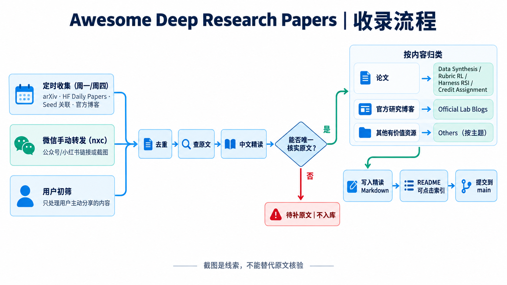

# Awesome Deep Research Papers

面向 Deep Research，尤其是多模态 Deep Research 的精读论文与研究资源库。

## 收录流程

收录有两种入口：每周一、周四从 arXiv、Hugging Face Daily Papers、Seed 关联工作和官方博客定时收集；平时由用户在微信 `nxc` 联系人窗口手动转发公众号／小红书链接或截图。两条入口都先去重、查找唯一原文，再按统一的中文精读格式处理。能核实原文的内容归入论文模块、Official Lab Blogs 或 Others 主题目录；只有二手推送或无法唯一核实原文的内容标记为“待补原文”，不进入仓库。

## 论文分类与收录索引

### Data Synthesis

数据构造、Deep Research 评测、证据链与图文交错报告。

| 论文 | 日期 | 主要机构 |
| --- | --- | --- |
| [MMDeepResearch-Bench](papers/data-synthesis/2601.12346.md) | 2026-01-18 | Ohio State；Amazon；多所高校 |
| [FrontierScience](papers/data-synthesis/2601.21165.md) | 2026-01-29 | OpenAI |
| [MiroEval](papers/data-synthesis/2603.28407.md) | 2026-03-30 | MiroMind AI |
| [TVIR](papers/data-synthesis/2606.02320.md) | 2026-06-01 | Nanjing University；Alibaba Group |
| [HiEviDR-Bench](papers/data-synthesis/2607.25151.md) | 2026-07-27 | Tsinghua University；UCAS；东北大学；上海交大 |
| [FinanceHarness](papers/data-synthesis/2607.27853.md) | 2026-07-30 | Google Cloud AI Research；UCLA |
| [From Simple QA to Deep Research](papers/data-synthesis/2608.02163.md) | 2026-08-03 | Shandong Key Laboratory；Alibaba Token Hub；ICT-CAS；PolyU |
| [SIEVE](papers/data-synthesis/2608.02751.md) | 2026-08-05 | University of Queensland；CSIRO |
| [Video-DeepResearch](papers/data-synthesis/2608.03979.md) | 2026-08-04 | Video-DeepResearch Team（待核对） |

### Rubric RL

Rubric 的生成、演进、奖励聚合与 criterion-level 信号。

| 论文 | 日期 | 主要机构 |
| --- | --- | --- |
| [GDPO](papers/rubric-rl/2601.05242.md) | 2026-01-08 | NVIDIA；HKUST |
| [Open Rubric System](papers/rubric-rl/2602.14069.md) | 2026-02-15 | Alibaba；中国科学院计算技术研究所；北京邮电大学 |
| [GEAR](papers/rubric-rl/2606.03361.md) | 2026-06-02 | Beihang University；Tsinghua University；BAAI |
| [CriPO](papers/rubric-rl/2607.18082.md) | 2026-07-20 | Zhejiang University；ByteDance |
| [Rubric Dropout](papers/rubric-rl/2608.11669.md) | 2026-08-12 | Scale AI；University of Arizona；UT Dallas |
| [A Survey on Rubric-Guided RL](papers/rubric-rl/2608.27505.md) | 2026-08-27 | WeChat, Tencent；Independent Researcher |

### Harness RSI

Harness、skill 与工作流从训练和执行经验中持续演进。

| 论文 | 日期 | 主要机构 |
| --- | --- | --- |
| [EvoTrainer](papers/harness-rsi/2606.03108.md) | 2026-06-02 | Alibaba Group；中科院；SUAT |
| [EvoHarness-RL](papers/harness-rsi/2608.05446.md) | 2026-08-05 | Meta AI；UIUC |
| [Agent Lightning v1.0](papers/harness-rsi/2608.17528.md) | 2026-08-18 | Microsoft；Fudan University；Zhejiang University；University of Edinburgh |
| [Recuris](papers/harness-rsi/2608.24876.md) | 2026-08-25 | NUS；Princeton；Stanford；Oxford |
| [JIT-Agent](papers/harness-rsi/2608.25593.md) | 2026-08-26 | LV-NUS Lab（待核对） |

### Credit Assignment

Agent RL 中将结果归因到步骤、工具调用、token 或子目标。

| 论文 | 日期 | 主要机构 |
| --- | --- | --- |
| [Information Gain-based Policy Optimization](papers/credit-assignment/2510.14967.md) | 2025-10-16 | Ant Group Venus Team；Renmin University；Individual Author |
| [From Reasoning to Agentic](papers/credit-assignment/2604.09459.md) | 2026-04-10 | 待核对 |

### Others

不属于上述方向、但对研究工作有价值的精读资源。

| 资源 | 主题 | 日期 |
| --- | --- | --- |
| [LoopArena](others/benchmarks/looparena.md) | Runtime Controller Benchmark | 2026-08-28 |
