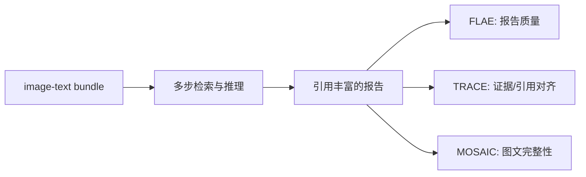

# MMDeepResearch-Bench: A Benchmark for Multimodal Deep Research Agents

- **arXiv**: [2601.12346](https://arxiv.org/abs/2601.12346)
- **版本**: v1
- **提交日期**: 2026-01-18
- **最后更新**: —
- **作者**: Peizhou Huang et al.
- **主要机构**: The Ohio State University；Amazon；University of Michigan；University College London；The Chinese University of Hong Kong；University of Hong Kong
- **主方向**: `Data Synthesis`
- **辅助标签**: `multimodal-deep-research`, `image-text-bundle`, `citation-grounding`, `benchmark`
- **阅读状态**: Seed 精读

## 一句话结论

MMDR-Bench 用 140 个、覆盖 21 个领域的 image-text bundle 任务，端到端检查视觉理解、检索、引用丰富的报告生成和图文证据一致性。

## 要解决的问题

文本 benchmark 或短答案 multimodal QA 无法覆盖 Deep Research 中“读附件、连接外部来源、写长报告、维护 citation 与 visual reference 一致”的完整链路。

## 先用大白话说

给模型一张图片和一段文字，让它写一篇有引用的研究报告。真正困难的是：模型既要看懂附件，又要继续上网找证据，还要让每个结论、引用和图中内容彼此对应。MMDR-Bench 专门把这条完整链路做成可评测任务。

这个问题的特点是输入不是纯文本，输出也不是一句答案，而是“报告 + 证据 + 引用 + 视觉参照”的组合。文笔好不代表 grounded；模型可能写得很像研究报告，却没有真正使用图片或引用错误来源。

## 一个具体例子

输入是一张公司收入趋势图和一段业务背景。模型需要先读出图中的年份与数值，再搜索公司公告核对数字，最后写“收入变化原因”的报告，并把每个数字绑定到来源。FLAE 主要看报告质量，TRACE 看引用是否真的支持，MOSAIC 看文字和图是否一致。

## 主流程（按论文方法简化）

原文方法图和评分脚本见 [项目主页](https://mmdeepresearch-bench.github.io/) 与 [arXiv 页面](https://arxiv.org/abs/2601.12346)。

## 方法拆解

- 每个任务提供 image-text bundle，要求模型将视觉 artifact 连接到 sourced claims。
- **FLAE** 评估整体 report quality；**TRACE** 评估 citation 与检索证据对齐；**MOSAIC** 检查 text–visual integrity。
- 三套指标输出细粒度信号，支持定位“文笔好但证据错”的失败，而非只给一个总分。

## 实验与证据

作者在 25 个 state-of-the-art model 上观察到 generation quality、citation discipline 和 multimodal grounding 的系统性 trade-off。项目页和官方代码提供 scoring 脚本及数据入口。

## 与 Seed 的关系

这是附件输入与多模态 evidence grounding 的直接 Seed。与 TVIR 的区别是 MMDR-Bench 更强调 image-text 输入包和证据完整性，TVIR 更强调图文交错输出和视觉子目标。

## 可迁移启示

数据记录应把输入 artifact、外部证据、claim、citation、视觉引用分别建模；收录论文时优先寻找能产生这些结构化中间标注的方法。

## 局限与待核对

- benchmark 任务和领域分布可能影响模型排序，需核对数据构造和泄漏控制。
- arXiv 页面未完整展示机构排布；本页机构依据项目主页作者标注。

## 相关链接

- Paper: [arXiv abstract](https://arxiv.org/abs/2601.12346)
- Code: [AIoT-MLSys-Lab/MMDeepResearch-Bench](https://github.com/AIoT-MLSys-Lab/MMDeepResearch-Bench)
- Dataset / Project: [项目主页](https://mmdeepresearch-bench.github.io/)
