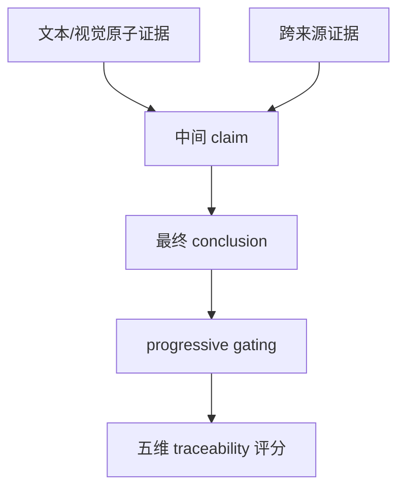

# HiEviDR-Bench: A Benchmark for Hierarchical Evidence Aggregation in Deep Research

- **arXiv**: [2607.25151](https://arxiv.org/abs/2607.25151)
- **版本**: v1
- **提交日期**: 2026-07-27
- **最后更新**: —
- **作者**: Yubo Sun et al.
- **主要机构**: Tsinghua University；University of Chinese Academy of Sciences；Northeastern University (China)；Shanghai Jiao Tong University
- **主方向**: `Data Synthesis`
- **辅助标签**: `evidence-graph`, `citation-traceability`, `multimodal`, `benchmark`
- **阅读状态**: Seed 精读

## 一句话结论

HiEviDR-Bench 将 evidence、intermediate claim 和 conclusion 建成显式 DAG，用五阶段 traceability 评测揭示“报告流畅”不代表证据聚合正确。

## 要解决的问题

既有 benchmark 多看最终 correctness、report quality 或 citation alignment，无法区分 retrieval failure、evidence linking 错误、claim construction 错误和 citation 不准。

## 先用大白话说

研究报告不是“搜到几段文字再拼起来”。正确链路应该是：先找到证据，再把多条证据连成一个中间判断，最后才推出结论。任何一条边断了，最终报告都可能只是看起来合理。HiEviDR-Bench 把这条链画成图，逐层检查。

这个问题的特点是错误会发生在不同层级：证据找错、跨来源连接错、从证据推断 claim 错、引用没有支撑结论。一个总分无法说明究竟是哪一层出问题。

## 一个具体例子

来源 A 给出销量，来源 B 给出市场份额。模型先把两者连成“公司增长领先”的中间 claim，再形成结论。如果 B 的市场份额其实属于另一地区，问题就发生在 evidence linking，而不是最后写作。证据图能精确标记这条错误边。

## 主流程（按论文 Figure 1 简化）

原文证据图和五维评测见 [arXiv HTML](https://arxiv.org/html/2607.25151)。

## 方法拆解

- 每个实例包含三层 evidence graph：atomic text/visual evidence、intermediate claims、final conclusion。
- 五维评估：report quality、evidence traceability、citation accuracy、claim verification、answer correctness。
- progressive gating：前一阶段不通过时，后续阶段不应掩盖错误。

## 实验与证据

数据含 2,000 个 human-validated questions，覆盖 open-domain/academic、text-only/multimodal 和三种难度；16 个 multimodal LLM 的结果显示 citation accuracy、claim construction、answer correctness 明显落后于表面 report quality。

## 与 Seed 的关系

这是 Data Synthesis 中 evidence-chain 标注最清晰的 Seed，也为 criterion-credit 提供天然的局部节点：错误发生在哪个 evidence-to-claim edge，比单一总分更适合训练。

## 可迁移启示

未来收录的任务合成论文应说明证据图、claim 单元、来源链接和 gating 规则，而不是只报最终答案分数。

## 局限与待核对

- 人工构建 2,000 个证据图的成本和一致性需要核对附录。
- DAG 表达未必覆盖所有循环检索和自我修正行为。

## 相关链接

- Paper HTML: [arXiv HTML](https://arxiv.org/html/2607.25151)
- Code/Dataset: [项目主页](https://ai9stars.github.io/HiEviDR-Bench.github.io)
