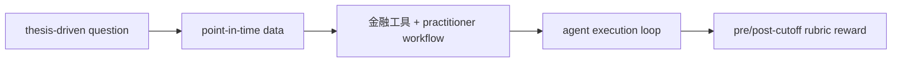

# FinanceHarness: Autonomous Financial Deep Research Framework

- **arXiv**: [2607.27853](https://arxiv.org/abs/2607.27853)
- **版本**: v2
- **提交日期**: 2026-07-30
- **最后更新**: 2026-08-07
- **作者**: Yijia Xiao et al.
- **主要机构**: Google Cloud AI Research；University of California, Los Angeles
- **主方向**: `Data Synthesis`
- **辅助标签**: `harness`, `financial-deep-research`, `point-in-time`, `rubric`, `benchmark`
- **阅读状态**: Seed 精读

## 一句话结论

FinanceHarness 将金融工具、从业者工作流、point-in-time 数据和 reward modeling 组合成可验证的领域 Deep Research harness。

## 要解决的问题

通用 Deep Research 报告不够适合金融：需要历史模式分析、未来事件预测和严格的时间截断，避免把未来信息泄漏进研究任务。

## 先用大白话说

金融研究有一个普通问答没有的陷阱：如果模型偷偷看到了截止日之后的财报或股价，报告会“神奇地”准确。FinanceHarness 不只给 agent 一组工具，还把数据时间、研究流程和评分规则一起锁住，尽量保证它真的在做当时能做的研究。

这个问题的特点是领域知识强、工具调用多、结论有时间点，而且错误可能来自未来信息泄漏、工具分布变化或 rubric 不完整。单纯换一个更大的模型不能解决这些问题。

## 一个具体例子

任务要求“基于 2025-06-30 前的信息判断某公司是否值得继续研究”。agent 可以查历史公告、估值和行业数据，但不能访问 7 月发布的结果。FinanceGym 同时检查 cutoff 前的研究过程和 cutoff 后才揭晓的结果，避免把未来答案直接当训练信号。

## 主流程（按论文框架简化）

原文 harness 组成、FinanceGym 和消融见 [arXiv HTML](https://arxiv.org/html/2607.27853)。

## 方法拆解

- harness 覆盖环境/数据构建、agent execution loop 和 reward modeling。
- FinanceGym 使用 thesis-driven questions 与 pre-cutoff/post-cutoff criteria，支持时间一致性和结果验证。
- 以 practitioner-guided workflow 和金融工具约束 agent 的研究路径。

## 实验与证据

专家验证 FinanceGym 通过率 82%；同一 open-weight backbone 下，FinanceHarness 将 overall rubric score 从 25.3% 提升到 32.4%，但即使搭配更强模型分数仍低于 45%，说明任务很难。

## 与 Seed 的关系

它横跨 Data Synthesis 与 Harness RSI：任务/数据构造是前者，领域工具、工作流和 reward loop 是后者。主方向放 Data Synthesis，辅助标签保留 harness。

## 可迁移启示

多模态 Deep Research 数据需要记录 cutoff、来源时间和可用工具集合；否则评测分数可能来自时间泄漏或工具分布差异，而非研究能力。

## 局限与待核对

- 金融领域专用 harness 的结论不应直接外推到科学研究。
- 需要进一步核对 tool-distribution shift 和各 reward axis 的消融。

## 相关链接

- Paper HTML: [arXiv HTML](https://arxiv.org/html/2607.27853)
- Code: [arXiv 项目链接](https://arxiv.org/abs/2607.27853)
- Dataset / Project: [FinanceGym leaderboard](https://financegym.github.io/)
