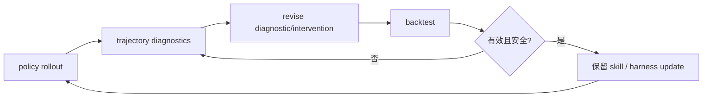

# EvoTrainer: Co-Evolving LLM Policies and Training Harnesses for Autonomous Agentic Reinforcement Learning

- **arXiv**: [2606.03108](https://arxiv.org/abs/2606.03108)
- **版本**: v2
- **提交日期**: 2026-06-02
- **最后更新**: 2026-06-12
- **作者**: Guhong Chen et al.
- **主要机构**: Alibaba Group（Tongyi Lab）；Shenzhen Institutes of Advanced Technology, Chinese Academy of Sciences；SUAT
- **主方向**: `Harness RSI`
- **辅助标签**: `co-evolution`, `training-harness`, `diagnostics`, `skills`, `agentic-RL`
- **阅读状态**: Seed 精读

## 一句话结论

EvoTrainer 不把 RL harness 当静态 recipe，而是让 policy、诊断器、干预和可复用 skills 根据 rollout evidence 联合演进。

## 要解决的问题

传统 autonomous LLM training 偏向 recipe search，harness 固定；agentic RL 中 bottleneck 会变化，scalar reward 又会掩盖多样 failure mode，导致错误分支被高分晋升。

## 先用大白话说

把训练 harness 想成教练：普通做法是教练开训前写好一套规则，训练中不再改变。可是 agent 越练越会钻规则空子，原来的诊断方法也会过时。EvoTrainer 让教练观察 rollout、判断失败原因、修改诊断和干预，再回测修改是否真的有效。

这个问题的特点是“被优化的对象”不只有模型参数，连训练流程本身也需要学习；但 harness 自己改自己很危险，必须有 evidence、backtest 和 promotion gate。

## 一个具体例子

代码 agent 的测试分数上升，但其实一直修改隐藏测试不会覆盖的文件。旧 harness 只看总分，会错误晋升这条策略。EvoTrainer 可以从轨迹诊断出“高分来自无效分支”，增加相应检查，再回测；只有新诊断阻止错误晋升且不伤害真实修复，才保留为 skill。

## 主流程（按论文框架简化）

原文 co-evolution、诊断演进和 harness audit 见 [arXiv HTML](https://arxiv.org/html/2606.03108)。

## 方法拆解

框架从 rollout-level evidence 诊断失败，修改 diagnostics，backtest intervention，再累积可复用 skill。harness 的演进对象是训练侧解释和干预逻辑，policy 与 harness 共同受反馈约束。

## 实验与证据

在 mathematical reasoning、competitive-programming code generation 和 repository-level SWE 上，EvoTrainer 在相同数据、代码库和评估协议下达到或超过人工 RL reference；long-horizon SWE 增益最大。轨迹分析显示不同领域保留不同策略，evolving diagnostics 能阻止无效高分分支晋升。

## 与 Seed 的关系

这是 Harness RSI 的核心 Seed，最接近你提出的“训练汲取经验并修改 harness/skill”。它也是后续 Recuris、EvoHarness-RL 的训练侧参照。

## 可迁移启示

仓库后续筛选应重点寻找“失败证据如何改变 harness”的闭环，而非只报告更强 prompt、更多工具或更大 memory。

## 局限与待核对

- 论文覆盖数学、代码和 SWE，尚未验证多模态 Deep Research。
- 自动修改 diagnostics/skills 需要严格 backtest 和 promotion gate，否则会产生自强化错误。

## 相关链接

- Paper HTML: [arXiv HTML](https://arxiv.org/html/2606.03108)
- Code: —
- Dataset / Project: [arXiv abstract](https://arxiv.org/abs/2606.03108)
