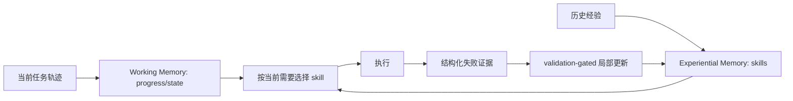

# Recursive Experiential–Working Memory Evolution for Long-Horizon Agent Harnesses

- **arXiv**: [2608.24876](https://arxiv.org/abs/2608.24876)
- **版本**: v1
- **提交日期**: 2026-08-25
- **最后更新**: —
- **作者**: Zhaochen Yu et al.
- **主要机构**: National University of Singapore；Princeton University；Stanford University；University of Oxford
- **主方向**: `Harness RSI`
- **辅助标签**: `recursive-self-improvement`, `working-memory`, `experiential-memory`, `skill-evolution`
- **阅读状态**: Seed 精读

## 一句话结论

Recuris 用 Working Memory 管当前任务状态、Experiential Memory 存可复用经验，并以验证门控的局部 skill 更新形成有界 RSI 闭环。

## 要解决的问题

长历史会遮蔽 task state，skill invocation 容易错配；一次性把全部历史塞进上下文既昂贵又无法定位失败来源。

## 先用大白话说

一个 agent 做几十步研究后，历史记录很长：哪些结论已经确认、下一步要查什么、以前遇到过什么坑，全部混在一起。Recuris 把“当前任务进度”和“过去积累的经验”分开存，让 agent 先看当前需要，再挑相关 skill，而不是每次重读全部历史。

这个问题的特点是长期任务的状态会持续变化，经验也会越积越多；如果任意改写 memory，错误会永久污染后续任务。因此更新必须局部、可验证、有边界。

## 一个具体例子

在多轮资料检索中，agent 当前卡在“核对图表来源”。Working Memory 提醒当前卡点，Experiential Memory 找到过去的 citation-check skill；执行后如果发现该 skill 只适用于文本表格，失败证据会定位到 skill，而不是把整个历史清空，系统只修订这一条 skill。

## 主流程（按论文 Figure 1 简化）

原文 memory 架构、门控更新和跨任务迁移见 [arXiv HTML](https://arxiv.org/html/2608.24876v1)。

## 方法拆解

- Working Memory 跟踪 progress，指导从 Experiential Memory 选择 skill。
- 执行轨迹被结构化为 evidence，可把失败定位到具体 memory component。
- 固定 Meta-Agent 只允许局部、validation-gated 的 Skill Memory 更新，更新后的 harness 产生新证据，再进入下一轮。

## 实验与证据

在 4 个 long-horizon benchmark、10 个模型上，37 个完成的 model–benchmark pair 中 35 个成功率提升；最长任务的优势可扩大到 32.2 points，常见 long-horizon failure 最多下降 80%。

## 与 Seed 的关系

这是 Harness RSI 的 memory/skill evolution 分支，与 EvoTrainer 的 training-side diagnostics 互补，与 EvoHarness-RL 的 runtime policy learning 形成三角对照。

## 可迁移启示

对 Deep Research，短期研究状态、可复用检索经验、citation/visual skill 应分层存储；更新必须局部、可验证、可回滚，不能让整段历史无门槛改写 harness。

## 局限与待核对

- 当前版本为 v1，结果和代码成熟度需持续核对。
- memory evolution 的写入成本、污染风险和跨任务迁移边界需要实证。

## 相关链接

- Paper HTML: [arXiv HTML](https://arxiv.org/html/2608.24876v1)
- Code: [arXiv code link](https://arxiv.org/abs/2608.24876)
- Dataset / Project: [arXiv abstract](https://arxiv.org/abs/2608.24876)
