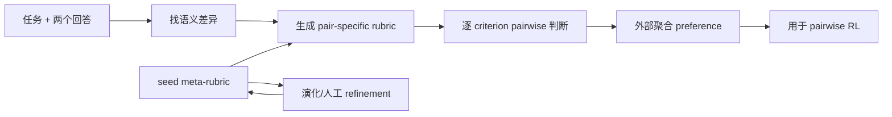

# Open Rubric System: Scaling Reinforcement Learning with Pairwise Adaptive Rubric

- **arXiv**: [2602.14069](https://arxiv.org/abs/2602.14069)
- **版本**: v3
- **提交日期**: 2026-02-15
- **最后更新**: 2026-08-25
- **作者**: Ruipeng Jia et al.
- **主要机构**: Alibaba（Qwen Large Model Application Team）；中国科学院计算技术研究所；北京邮电大学
- **主方向**: `Rubric RL`
- **辅助标签**: `rubric-evolution`, `pairwise-judge`, `criterion-credit`, `scalarization`
- **阅读状态**: Seed 精读

## 一句话结论

OpenRS 把 Rubric 从静态评分表提升为可编辑的 meta-rubric，并用 pairwise、criterion-wise 判断提供更可审计的 RL 信号。

## 要解决的问题

Scalar reward model 把多维偏好压成一个 opaque score，带来信息瓶颈、跨任务校准困难和 reward hacking。静态 rubric 也无法随着领域和失败模式演进。

## 先用大白话说

假设两个研究报告都回答了同一个问题：报告 A 事实基本正确，但写得普通；报告 B 排版漂亮、语气自信，却漏了关键来源。一个“总分 8.2/10”的 judge 很可能说不清两者到底谁更好，也看不出 B 的 citation 缺陷。OpenRS 的想法是：先问“这两个回答具体差在哪里”，再只针对这些差异设计检查项，逐项比较，最后把逐项结果交给训练程序处理。

这个问题的特点是没有唯一标准答案，质量由事实、引用、完整性、风格等多个维度组成；这些维度还会随任务和领域变化。因此固定一张评分表或一个 scalar reward 很容易被模型钻空子。

## 一个具体例子

研究任务要求“比较两种多模态检索方法，并给出带来源的图表”。系统发现回答 A 有可靠来源但没有图，回答 B 有漂亮图表但图中数字无法追溯。OpenRS 会把“图表是否支撑结论”“数字是否有来源”作为本次 pair 的重点 criteria，而不是套用与任务无关的通用文采分。这样训练信号会告诉模型：这次真正需要改的是 evidence grounding。

## 主流程（按论文 Figure 1 简化）

原文主图和完整公式见 [arXiv HTML](https://arxiv.org/html/2602.14069) 的 Figure 1。

## 方法拆解

1. **Hierarchical Meta-Rubric**：用通用原则和领域原则规定 criteria 如何生成、加权和约束。
2. **Pairwise Adaptive Rubric (PAMR)**：先找两个回答的语义差异，再为该 pair 生成聚焦 criteria，逐项比较而非分别打绝对分。
3. **Pointwise Verifiable Rubric (PVR)**：对格式、单元测试、可验证正确性提供硬约束或额外奖励。
4. **Meta-rubric refinement**：通用层使用 evolutionary refinement，领域层保留 human-in-the-loop 编辑；judge 本身不训练。

criterion-level 结果在 judge 外部聚合，因此每个判断仍可检查；pairwise group 训练使用动态 anchor，避免完整 pairwise 比较的二次复杂度。

## 实验与证据

论文报告 OpenRS 在 RM-Bench、JudgeBench、RewardBench v2 和 PPE Preference 四个 reward-modeling benchmark 上超过 scalar RM 和 trained generative judge；接入 pairwise RL 后下游评测稳定提升。HTML 正文给出 PAMR/PVR、meta-rubric refinement 和 BRPO 的算法细节。

## 与 Seed 的关系

这是 `rubric-evolution` 的核心 Seed：直接回答“rubric 如何自演进”和“为什么不应把 criterion 信息过早压成单一分数”。与 CriPO、GDPO 的关系分别是 rubric 规范层、criterion credit 层和多 reward normalization 层。

## 可迁移启示

多模态 Deep Research 可把 citation support、visual grounding、chart-source consistency 等作为可审计 criteria，并让 meta-rubric 记录不可妥协的失败模式，而不是只维护一个总分 prompt。

## 局限与待核对

- pairwise judge 调用和 meta-rubric refinement 的成本需结合实际 rollout budget 评估。
- 论文强调外部聚合，但最终 RL 仍需要可优化的 per-sample 信号；不同聚合器的 credit assignment 需单独验证。
- 领域 meta-rubric 仍依赖人工诊断，不是完全自动闭环。

## 相关链接

- Paper HTML: [arXiv HTML](https://arxiv.org/html/2602.14069)
- Code: [OpenRS](https://github.com/Qwen-Applications/OpenRS)
- Dataset / Project: [arXiv abstract](https://arxiv.org/abs/2602.14069)
