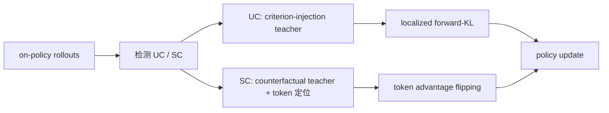

# CriPO: Enhancing Rubric-based RL via Self-Distillation

- **arXiv**: [2607.18082](https://arxiv.org/abs/2607.18082)
- **版本**: v3
- **提交日期**: 2026-07-20
- **最后更新**: 2026-08-03
- **作者**: Mingxuan Xia et al.
- **主要机构**: Zhejiang University；ByteDance
- **主方向**: `Rubric RL`
- **辅助标签**: `criterion-credit`, `unexplored-criteria`, `suppressed-criteria`, `self-distillation`
- **阅读状态**: Seed 精读

## 一句话结论

CriPO 用 on-policy self-distillation 同时修复“从未探索到的 criteria”和“已满足但被 scalar advantage 压掉的 criteria”。

## 要解决的问题

Unexplored Criteria（UC）没有 rollout 满足，因而没有优化信号；Suppressed Criteria（SC）虽被部分 rollout 满足，却因总 reward 的非正 advantage 丢失局部学习信号。作者统计超过 57% 的样本出现 SC，平均每个样本 1.8 个。

## 先用大白话说

一份答案有三个要求：给出正确结论、解释关键推理、引用可靠来源。某次 rollout 虽然满足了“引用可靠来源”，但另外两项很差，最后总分为负，于是训练算法把整段答案都当成坏例子，连这条正确的引用行为也一起惩罚。反过来，如果所有 rollout 都没有展示某项能力，模型也学不到那项能力。CriPO 把这两种情况分开处理。

这个问题的特点是最终 scalar reward 太粗，无法告诉训练过程“哪条 criteria 已经出现、哪条完全没探索、哪一小段 token 值得保留”。它还要求修复不能依赖只在训练时存在的外部提示，否则训练和推理会不一致。

## 一个具体例子

在多模态研究报告里，某个 rollout 没有完整回答问题，却正确引用了一张图表的原始来源。CriPO 用 counterfactual self-teacher 找到与这条 criteria 相关的 token，把这些 token 的 advantage 翻正；对于任何 rollout 都没提到的“图表来源一致性”，则生成 criterion-injection teacher，局部教 policy 补上这个行为。

## 主流程（按论文 Figure 1 简化）

原文的 UC/SC 定义、token 定位和消融见 [arXiv HTML](https://arxiv.org/html/2607.18082)。

## 方法拆解

- UC：构造 criterion-injection self-teacher，使用 localized forward-KL 把缺失行为注入 policy。
- SC：用 counterfactual self-teacher 定位与 criterion 相关的 token，把原本负的 token-level advantage 翻为正值，保留有用模式。
- 两条路径都从 on-policy rollout 产生，避免“训练有外部 guidance、推理没有”的 train–inference mismatch。

## 实验与证据

在 medicine/science benchmark 上，CriPO 超过 rubric-based RL baseline，并以约两倍更少 optimization steps 达到更强最终表现；正文包含 UC/SC 统计、token 定位案例和消融。

## 与 Seed 的关系

这是当前 Seed 中最直接的 `criterion-credit` 论文：把“最终 scalar 计算掩盖单项满足”具体化为 SC，并把修复落到 token-level training signal，而非只改评估 prompt。

## 可迁移启示

对图文报告可分别定位 citation、visual grounding、source consistency 等 criteria 的贡献 token/片段，避免长报告中局部正确内容被总分惩罚；需要额外验证视觉 token 或工具调用轨迹的定位方法。

## 局限与待核对

- criterion-relevant token 的定位依赖 self-teacher 判断，错误定位可能放大噪声。
- medicine/science 结果不能直接等价于多模态 Deep Research 结果。

## 相关链接

- Paper HTML: [arXiv HTML](https://arxiv.org/html/2607.18082)
- Code: —
- Dataset / Project: [arXiv abstract](https://arxiv.org/abs/2607.18082)
